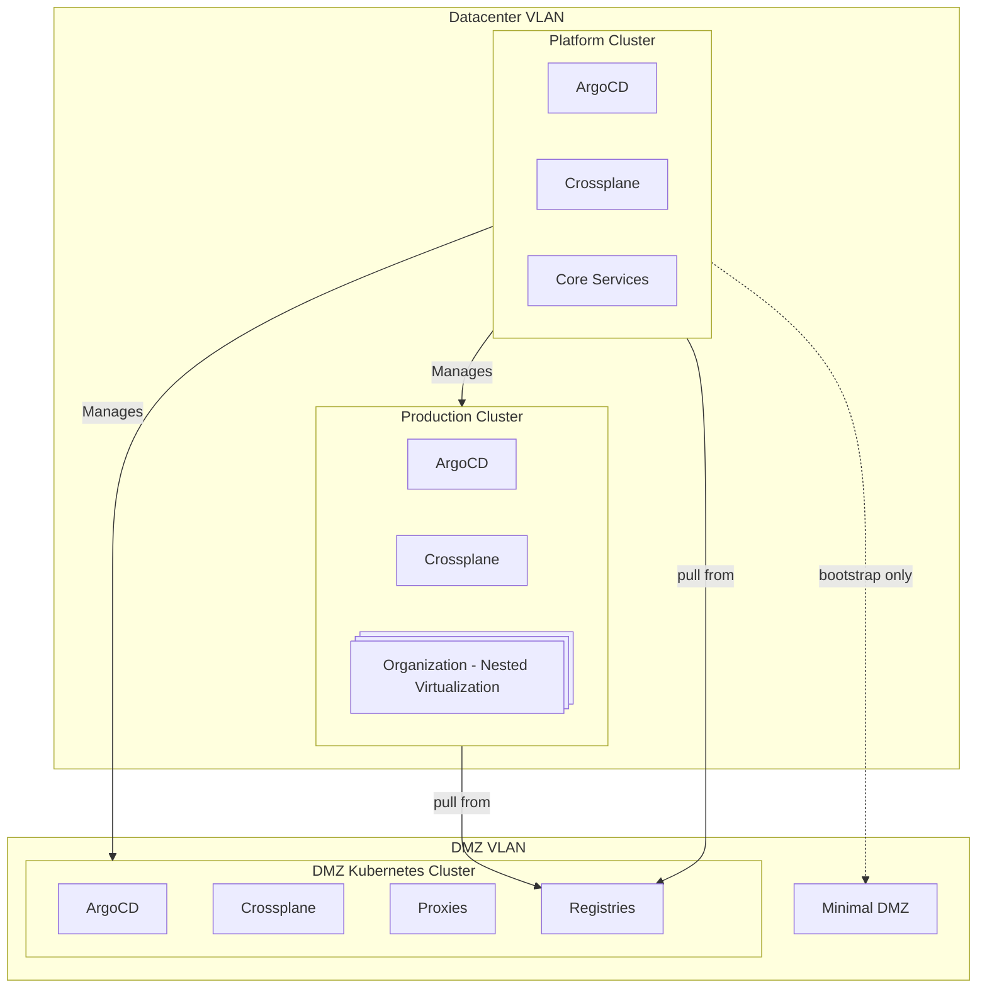

# Cloud-Native Developer Platform (CNDP) Architecture

## 1. Introduction

### 1.1 Purpose
CNDP is a **self-service, fully automated platform** designed to abstract infrastructure complexities for developers. It enables teams to provision infrastructure, deploy applications, and manage services without needing deep platform expertise. The platform integrates concepts from cloud providers and developer-first platforms while running on **bare-metal infrastructure with no direct internet access** for core services.

### 1.2 Scope
CNDP provides:
- **Infrastructure as Code (IaC)** with GitOps principles.
- **Multi-tenancy support** with strong isolation between organizations.
- **Automated provisioning** of Kubernetes clusters, services, and applications.
- **Security-first architecture** with strict access controls and network segmentation.

This document defines the **architecture, deployment model, and operational principles** of CNDP.

## 2. Constraints

### 2.1 Technical Constraints
CNDP runs entirely on **bare-metal hardware**, meaning no reliance on managed cloud services. The **Platform and Production clusters are air-gapped**, requiring a **DMZ cluster** to provide controlled external access for container registries, Git mirrors, and other dependencies.

The **Production cluster utilizes nested virtualization** to provide multi-tenant workloads with strict isolation. All infrastructure is provisioned through **Crossplane and ArgoCD**, enforcing a **fully declarative, GitOps-driven model**.

### 2.2 Organizational Constraints
CNDP is built for **a single developer or small teams**, requiring minimal manual intervention while maintaining high security. The **Platform cluster defines organizations, projects, and environments**, but once provisioned, these are **self-managed within the Production cluster**. Developers interact only with **pre-defined abstractions** and cannot modify infrastructure components directly.

### 2.3 Compliance & Security Constraints
Strict security policies enforce **RBAC, network segmentation, and image verification**. Since Platform and Production clusters have no internet access, **software supply chains must be pre-validated**. Logging and auditing are mandatory to ensure traceability and compliance with internal policies.

## 3. Architecture Overview

CNDP consists of multiple Kubernetes clusters, each serving a distinct function:

- **Platform Cluster**: Provisions and governs infrastructure, running core services such as authentication, monitoring, and GitOps controllers.
- **Production Cluster**: Hosts developer workloads, supporting nested virtualization for strong multi-tenancy.
- **DMZ Cluster**: Acts as the only externally connected component, hosting proxies, registries, and artifact mirrors.
- **Bootstrap Node (RPI)**: Temporarily provides registry and proxy services during initial cluster setup.

All infrastructure is managed declaratively, with **each cluster running its own GitOps stack (ArgoCD + Crossplane)** to ensure self-reconciliation.

## 4. Provisioning & Bootstrapping

### 4.1 Bootstrapping Process
1. **The Bootstrap Node (RPI) is manually set up** to provide temporary registry and proxy services.
2. **The Platform cluster is provisioned**, deploying ArgoCD and Crossplane.
3. **The DMZ cluster is created** and takes over external dependencies.
4. **The Production cluster is provisioned** to host developer workloads.
5. **The Bootstrap Node is decommissioned** once the DMZ is fully operational.

### 4.2 GitOps Workflow
- **Platform cluster provisions and bootstraps all other clusters**.
- **Each cluster manages its own applications via its own GitOps stack**.
- **Production and DMZ clusters are self-contained**, preventing cross-cluster dependencies.

## 5. Security Model

### 5.1 Network Segmentation
- **Platform and Production clusters have no internet access**.
- **DMZ cluster mediates external connectivity**.
- **Strict firewall rules enforce isolation between clusters**.

### 5.2 Identity & Access Management
- **Keycloak handles authentication** with RBAC policies applied at the cluster level.
- **Developers only interact with predefined abstractions**; infrastructure access is restricted.

### 5.3 Software Supply Chain Security
- **Only pre-validated container images and artifacts are allowed**.
- **Registries inside the DMZ sync externally but serve only internal consumers**.

## 6. Observability & Monitoring

- **Prometheus and Loki** handle metrics and logs, respectively.
- **ArgoCD and Crossplane provide reconciliation status dashboards**.
- **Audit logs ensure compliance and traceability**.

## 7. Disaster Recovery & High Availability

- **All infrastructure definitions are stored in Git**, allowing full declarative recovery.
- **Platform and Production clusters are deployed in HA mode**.
- **DMZ remains a single-node cluster but can be scaled if needed**.

## 8. Future Considerations

- **Scaling the DMZ to HA** for better reliability.
- **Expanding network policies to enforce stricter inter-cluster communication rules**.
- **Enhancing developer experience with more self-service capabilities**.

---
This document serves as the foundation for CNDP. Additional implementation details will be documented as they evolve.
